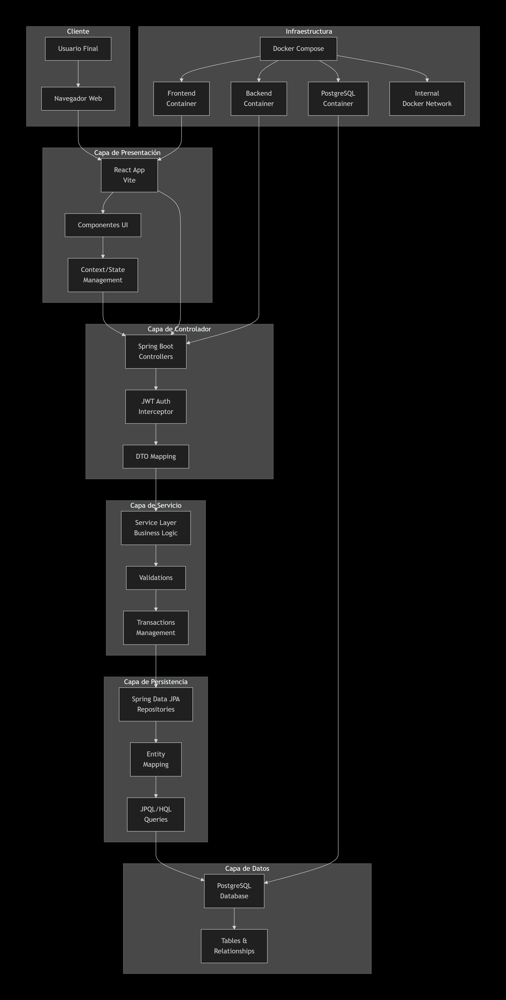

# Arquitectura

El sistema POS “El Hogar” implementa una **arquitectura en capas** que separa las responsabilidades en niveles bien definidos, facilitando la escalabilidad y el mantenimiento del código.

### Capas del sistema

1. **Frontend (Presentación):**
   * Desarrollado con **React + Vite**.
   * Consume los endpoints REST del backend mediante Axios.
   * Maneja la autenticación por medio de tokens JWT almacenados en `localStorage`.
2. **Backend (Lógica de negocio):**
   * Construido con **Spring Boot**.
   * Expone una API REST segura.
   * Aplica principios **SOLID** y arquitectura en capas (`controller`, `service`, `repository`, `model`).
3. **Base de datos:**
   * Sistema gestor: **PostgreSQL**.
   * Define entidades como productos, ventas, usuarios, proveedores, etc.
   * Se comunica con el backend mediante JPA/Hibernate.
4. **Seguridad:**
   * Implementa **JWT Auth0** para autenticación.
   * Encripta contraseñas con `bcrypt`.
5. **Contenedorización:**
   * Se utiliza **Docker Compose** para levantar los servicios (backend, frontend y base de datos).

### Diagrama de arquitectura&#x20;

<figure><figcaption></figcaption></figure>
