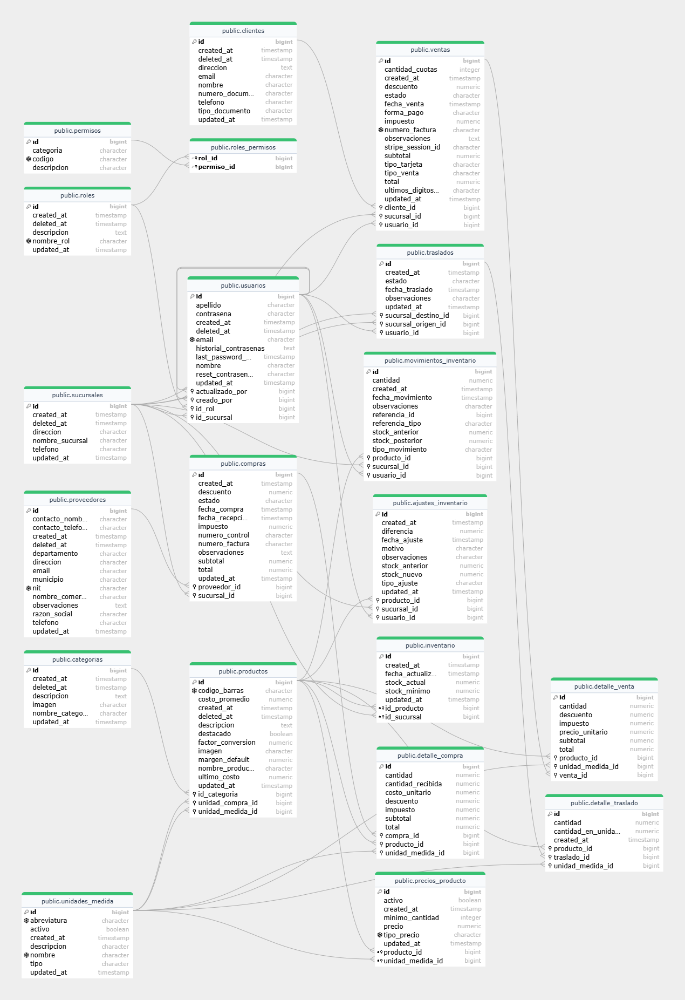

# Base De Datos

La base de datos de “El Hogar” está implementada en **PostgreSQL**.\
Su estructura fue diseñada con base en las reglas de normalización y las relaciones entre entidades del negocio.

### Principales tablas

* **productos:** almacena información de los artículos en venta.
* **ventas:** registra cada transacción realizada.
* **detalle\_venta:** relaciona productos con sus ventas.
* **usuarios:** contiene los datos de acceso y roles.
* **proveedores:** almacena los datos de proveedores.
* **compras:** controla las adquisiciones de productos.
* **traslados:** gestiona los movimientos entre sucursales.

### Diagrama Entidad-Relación&#x20;

<figure><figcaption></figcaption></figure>

Script de la base de datos a continuacion ....
