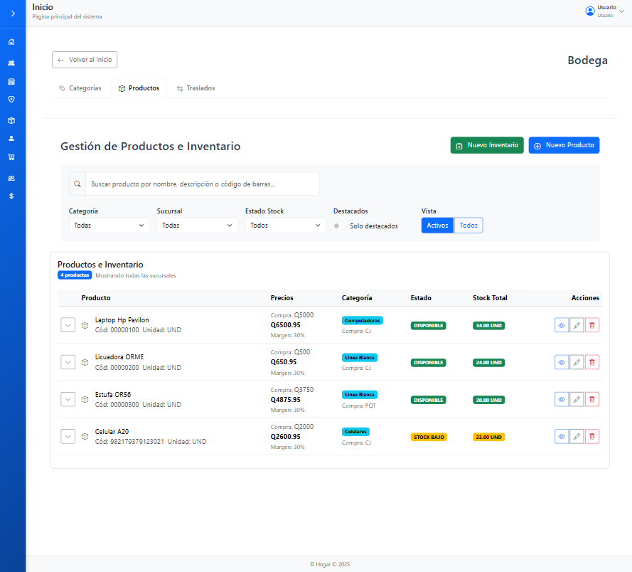

# Modulos Del Sistema

### Módulo 1: Gestión de Productos

**Propósito:** Gestionar catálogo de productos, categorías, precios y unidades.\
**Entidades:** `productos`, `categorias`, `unidades_medida`, `precios_producto`\
**Funcionalidades:**

* Registrar y editar productos
* Gestionar categorías y unidades
* Configurar precios (minorista/mayorista)
* Búsqueda y filtros

<figure><figcaption></figcaption></figure>

### Módulo 2: Inventario y Ajustes de Stock

**Propósito:** Controlar stock por sucursal y movimientos de inventario.\
**Entidades:** `inventario`, `movimientos_inventario`, `ajustes_inventario`\
**Funcionalidades:**

* Consultar stock por sucursal
* Ajustes manuales de inventario
* Historial de movimientos
* Alertas de stock mínimo

<figure><figcaption></figcaption></figure>

<figure><figcaption></figcaption></figure>

### Módulo 3: Compras y Proveedores

**Propósito:** Gestionar compras a proveedores y recepción de mercancía.\
**Entidades:** `compras`, `detalle_compra`, `proveedores`\
**Funcionalidades:**

* Registrar órdenes de compra
* Gestionar proveedores
* Recepción de mercancía
* Actualización de costos

<figure><figcaption></figcaption></figure>

<figure><figcaption></figcaption></figure>

### Módulo 4: Ventas y Clientes

**Propósito:** Gestionar proceso de venta y información de clientes.\
**Entidades:** `ventas`, `detalle_venta`, `clientes`\
**Funcionalidades:**

* Procesar ventas en punto de venta
* Gestionar clientes
* Múltiples formas de pago
* Facturación y reportes

<figure><figcaption></figcaption></figure>

<figure><figcaption></figcaption></figure>

### Módulo 5: Usuarios, Roles y Permisos

**Propósito:** Controlar acceso al sistema mediante roles y permisos.\
**Entidades:** `usuarios`, `roles`, `permisos`, `roles_permisos`\
**Funcionalidades:**

* Gestionar usuarios y roles
* Asignar permisos
* Autenticación JWT
* Auditoría de acciones

<figure><figcaption></figcaption></figure>

<figure><figcaption></figcaption></figure>

### Módulo 6: Traslados entre Sucursales

**Propósito:** Gestionar movimiento de productos entre sucursales.\
**Entidades:** `traslados`, `detalle_traslado`, `sucursales`\
**Funcionalidades:**

* Solicitar y aprobar traslados
* Recepción en destino
* Ajuste automático de inventario
* Seguimiento de estado

<figure><figcaption></figcaption></figure>

### Módulo 7: Sucursales

**Propósito:** Gestionar información de sucursales.\
**Entidades:** `sucursales`\
**Funcionalidades:**

* Registrar y configurar sucursales
* Asignar usuarios
* Consultar información

<figure><figcaption></figcaption></figure>

### Módulo 8: Reportes y Analytics

**Propósito:** Generar reportes para toma de decisiones.\
**Funcionalidades:**

* Reportes de ventas, inventario, compras
* Dashboard con KPIs
* Reportes personalizados

<figure><figcaption></figcaption></figure>

### Flujos de Trabajo Entre Módulos

#### Proceso de Venta

1. **Ventas** consulta stock a **Inventario**
2. **Ventas** registra cliente desde **Clientes**
3. **Ventas** procesa pago y actualiza **Inventario**

#### Proceso de Compra

1. **Compras** registra orden con **Proveedores**
2. **Compras** recepciona mercancía y actualiza **Inventario**
3. **Inventario** actualiza costos en **Productos**
